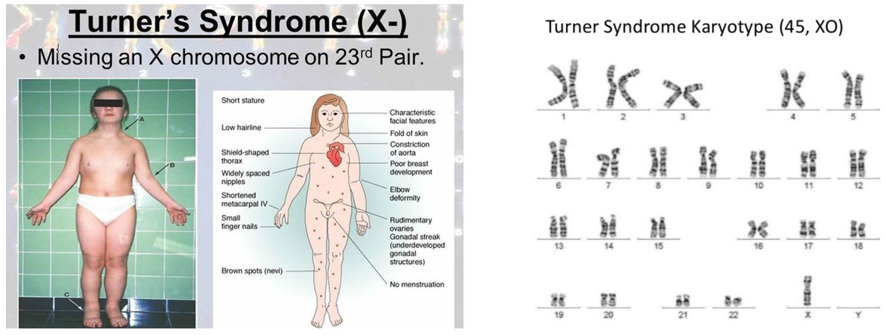
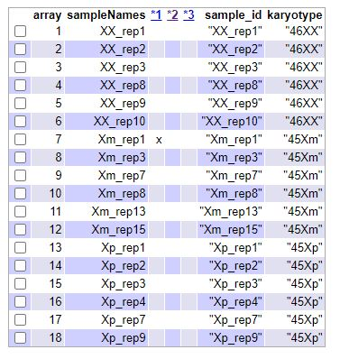

<br>


```{r setup, include=FALSE, echo=FALSE, fig.width = 10, fig.height = 10, out.width = "400px", out.height="300px"}
knitr::opts_chunk$set(echo = FALSE, message = FALSE, eval = TRUE, warning = FALSE, comment=NA)

```
#### **Máster de Bioinformática y Bioestadística**
##### Análisis de datos ómicos: PEC 1
##### Dani Ibáñez 26-4-2021
<br>
<br>

<center>
### **DESCRIPCIÓN DEL ESTUDIO: Síndrome de Turner**
</center>

<br>

#### **Descripción general**

El síndrome de Turner és una patología descubierta por el propio endocrinólogo Henry Turner que afecta solo a mujeres y que se detecta, principalmente, por unos pliegues en el cuello en niñas pequeñas o recién nacidas y en un crecimiento que se para prematuramente quedando con estaturas claramente inferiores a la media. Esterilidad, extremidades hinchadas, genitales y mamas subdesarrolladas, son algunas otras características clínicas.

Aunque se describió esta patología en 1938, fue en 1959 cuando un grupo de científicos descubrieron la principal característica para su detección rápida. Se trata de personas que solo tienen un cromosoma X completo, pudiendo tener parte del segundo o la mayoría con un solo cromosoma sexual X. Es por ello que se identifican como personas con 45 cromosomas (45X). Si el cromosoma X único o entero viene del padre hablaremos de genotipo 45xp, y si procede de la madre hablaremos de genotipo 45Xm.

Parece demostrado que no es hereditario, pero a su vez se considera que la mayoría de incidencia es causada por el cromosoma X aportado por el padre, por lo que se considera que son patologías generadas o en el proceso de meiosis de los padres o en las primeras fases de multiplicación embrionaria. Esta segunda opción podría explicar por qué algunas mujeres presentan células con los dos cromosomas XX y otras células sin uno de ellos.

No hay un tratamiento específico definido si bien, el principal problema que es la baja estatura responde a tratamientos de estimulación de hormona del crecimiento.

<br>



**Fuente: Página web healthjade.com**

<br>

#### **Descripción del estudio**

Al margen de los problemas de nacimiento, parece que existe predisposición de padecer enfermedades más graves como problemas cardiovasculares, diabetes o enfermedades de caracter autoinmune. Con este objetivo se realizan estudios de expresión génica comparando muestras de pacientes con esta patología.

En concreto, los científicos 	Cheng CM, Zhou J, Bondy C y otros, realizaron un análisis basado en 36 muestras distribuidas como sigue:

- 10 muestras de 10 mujeres con ambos cromosomas XX ("normales" 46,XX) que nos sirven de referencia.
- 16 muestras de 16 mujeres con un solo cromosoma X de procedencia materna 45,Xm
- 10 muestras de 10 mujeres con un solo cromosoma X de procedencia paterna 45,Xp

El experimento está realizado sobre microarray de affymetrix U133 versión 2.0 (GPL570) y se ha registrado en GEO con el repositorio GSE46687

Como ampliación de la información, el probe set U133 2.0 contiene un catálogo ampliado respecto la primera versión de U133. En este caso hablamos de 47.000 tránscritos distintos que se corresponden con 38.500 genes. 

<br>

#### **Subset de 18 muestras para el estudio**

Para realizar el ejercicio de la PEC1, se ha extraído un subset de la muestra total de 36. En concreto se va a trabajar con una selección aleatoria de 6 muestras de cada uno de los 3 tipos, es decir 18 muestras, 6 XX (mujeres con los dos cromosomas X), 6 Xm (mujeres con un único cromosoma de origen materno) y 6 Xp (6 mujeres con un único cromosoma de origen paterno). Como se indica más abajo esta subselección aleatoria se ha realizado en base al número IDP de la UOC del alumno, en mi caso **IDP: 1083627** 

<br>

#### **Documentación**
  
Para realizar el estudio he utilizado como guía la seguida por el Sr. Alex Sánchez en el estudio del caso GSE100924:

https://aspteaching.github.io/Omics_Data_Analysis-Case_Study_1-Microarrays/Case_Study_1-Microarrays_Analysis.html

Al final del documento se citan otras referencias usadas.

En el presente documento HTML no aparece el código, que sí se adjunta como archvio **rmd** aparte.
El código incluye código de debug que se ha anulado con el caracter # pero se ha mantendo para que puedan comprobarse algunos pasos realizados.


__________________________________________________________________________________________________

<br>

### PREPARACIÓN DE ENTORNO DE TRABAJO
  
<br>

#### **Carga de paquetes Bioconductor**

Para empezar vamos a instalar todos los paquetes necesarios para el estudio. La mayoría tienen relación con Biocondutor.
Uno de los que tenemos que instalar es el feature data del microarray del estudio, en este caso el U133 plus 2.
En concreto el paquete se llama "hgu133plus2.db". Toda esta información se puede obtener de la página web de BIOCONDUCTOR:

https://bioconductor.org/packages/release/data/annotation/html/hgu133plus2.db.html


```{r carga de paquetes}

# if (!requireNamespace("BiocManager", quietly = TRUE))
#     install.packages("BiocManager")
# BiocManager::install()

#if(!(require(knitr))) install.packages("knitr")
#if(!(require(colorspace))) install.packages("colorspace")
#if(!(require(gplots))) install.packages("gplots")
#if(!(require(ggplot2))) install.packages("ggplot2")
#if(!(require(ggrepel))) install.packages("ggrepel")
#if(!(require(htmlTable))) install.packages("htmlTable")
#if(!(require(prettydoc))) install.packages("prettydoc")
#if(!(require(devtools))) install.packages("devtools")
#if(!(require(BiocManager))) install.packages("BiocManager")

# install.packages("Rtools")
# BiocManager::install("oligo")
# BiocManager::install("arrayQualityMetrics")
# BiocManager::install("pvca")


# PAQUETES NECESARIOS PARA EL ANALISIS

# BiocManager::install("limma")
# BiocManager::install("genefilter")
# BiocManager::install("annotate")
# BiocManager::install("ReactomePA")
# BiocManager::install("reactome.db")
# BiocManager::install("hgu133plus2.db")

```
  
<br>

#### **Creación del espacio de trabajo**

La gran cantidad de información nos "obliga" a estructurar la información en directorios. podemos seguir el convenio habitual en crear un directorio **data** y un directorio **results**. Además el proceso de workflow generará otros directorios que iremos viendo.


```{r espacio de trabajo}

setwd("C:/MASTER/OMICAS/ENTREGA PEC1")
if (!dir.exists("data")) {dir.create("data")}
if (!dir.exists("results")) {dir.create("results")}

```
  
<br>

#### **Subset de muestras**

Tal como he informado antes, para este estudio se nos indica trabajar con un subset de las 36 muestras originales. En concreto nos piden aplicar la función del enunciado usando nuestro número IDP.


En mi caso, con **IDP: 1083627**, las muestras seleccionadas son las siguientes:  
  
  

```{r selección subset mediante idp}

selectSamples<- function (myID){
 set.seed(myID)
 selected <- c(sample(1:10, 6),11, sample(12:26, 5), sample(27:36,6)) 
 selected <- sort(selected)
 }
 
samples_idp = selectSamples(1083627)
samples_idp
```

<br>
  
A partir de aquí establecemos nuestro set de muestras personalizado con las 18 columnas concretas obtenidas.
He cambiado el nombre de la columna de muestra **"sample_id"** y la del grupo es **"karyotype"**

Comprobamos cuales son y presentamos la tabla de los valores Phenodata:
  
<br>

##### **Subset de muestras seleccionadas para la PEC1 para IDP:1083627**  
  
  

```{r subset 18 muestras targets}

targetsAll <-read.csv(file="./data/targetsAll.csv", row.names = 1, head=TRUE)
#row.names(targetsAll)
targets18 <- targetsAll[samples_idp,] # cogemos solo las columnas marcadas por el IDP
#length(targets18)
#row.names(targets18)
colnames(targets18)[1]<-"sample_id"
#colnames(targets18)
#class(targets18)
#rownames(targets18)
muestras <- targets18$sample_id

knitr::kable(targets18, booktabs = TRUE)

```


<br>

### **CARGA DE DATOS DEL ESTUDIO**
  
<br>

#### **Lectura de los archivos CEL correspondientes a nuestra selección**

A partir del repositorio GSE en la página web de OMNIBUS:

https://www.ncbi.nlm.nih.gov/geo/query/acc.cgi?acc=gse46687

Hemos descargado manualmente todos los archivos CEL y he dejado en el disco solo los correspondientes a las 18 muestras seleccionadas.
Este proceso lo he realizado manualmente.

Por otra parte he creado manualmente un archivo llamado **targets18.csv** que contiene solo los registros de las 18 muestras seleccionadas. Los campos de este archivo vienen separados por coma.

Una vez eliminados los 18 sobrantes, hemos descomprimido los archivos y ahora ya estamos en disposición de leerlos mediante las funciones **list.celfiles** , **read.AnnotatedDataFrame()** y **read.celfiles()**

Para ello cargamos las librerías **oligo** y **Biobase** y obtenemos dos variables importantes a partir de este instante:

- **my.targets** es el archivo de las 18 muestras.Le vamos a cambiar los nobres de las variables colnames()
  
- **rawData** es el DataFrame en que hemos cargado los datos en bruto procedentes de los archviso CEL.

<br>


```{r carga de datos de las muestras en bruto}

library(oligo)
celFiles <- list.celfiles("./data", full.names = TRUE) # lee los archivos CEL del directorio /data
#celFiles
library(Biobase)
my.targets <-read.AnnotatedDataFrame(file.path("./data","targets18.csv"), header = TRUE, row.names = 1, sep=",") 
my.targets
#rownames(my.targets)
cat("variables de my.targets: ",colnames(my.targets))
colnames(my.targets) <- c("sample_id","karyotype")
cat("variables modificadas de my.targets: ",colnames(my.targets))

rawData <- read.celfiles(celFiles, phenoData = my.targets)
cat("Comprobamos Clase rawData: ",class(rawData))

#rownames(pData(rawData))
#colnames(rawData)
knitr::kable(pData(rawData), booktabs = TRUE, caption = 'Tabla phenotipo de rawData GSE46687')
#pData(rawData)

muestras -> rownames(pData(rawData))
colnames(rawData) <-rownames(pData(rawData)) 
#head(pData(rawData))
#rawData
#colnames(rawData)

cat("Comprobamos las dimensiones de los datos en rawData")
dim(exprs(rawData))
cat("Comprobamos las primeras filas del rawData")
head(exprs(rawData)[,1:6],10) # primeras filas de las 8 primeras columnas
cat("Comprobamos las últimas filas del rawData")
tail(exprs(rawData)[,13:18],10) # últimas filas de las 8 columnas restantes

```

<br>

#### **Observaciones sobre los datos**

Como observaciones a los datos del rawData comentamos los siguientes puntos:

- Estamos ante una matriz de casi **millón y medio** de registros. Está claro que son datos en bruto, pues no tenemos millón y medio de tránscritos.
- Nos hemos fijado en que la serie muestra un dato alto y otro bajo de forma sucesiva. Creemos que eso se debe a la **técnica del mismatch**, es decir, la técnica que ofrece en la lectura, una sonda que encaja con el tránscrito y otra donde se ha modificado el nucleótido central. Por lo tanto es lógico que en la primera encaje y en la segunda debe no encajar.
- Hemos modificado los nombres de las columnas ya que nos añade una x. un poco engorrosa.

Una vez observados los datos en bruto, pasamos a plantear el estudio y a realizarlo.

<br>

### **PLANTEAMIENTO INICIAL DEL ESTUDIO Y PRIMERAS REFLEXIONES**
  
<br>

#### **Ampliando la información mediante getGEO()**

El archivo **targetsAll** que se nos ha proporcionado es muy escueto y no sé seguro si hay información adicional en el repositorio de Omnibus que nos ayude a realizar el estudio. Para ello buscaré en el **PhenoData** del repositorio GSE46687.

library(GEOquery)

-Turner <- getGEO("GSE46687",GSEMatrix=TRUE)

-str(pData)

-head(pData)

-NOTA: Se adjunta todo el código R utilizado.


He indicado las lineas justas para comprobar que el repositorio GSE46687 **no aporta información adicional**. Podría parecer que **Gender** sería un dato importante pero son todo mujeres como ya hemos dicho al inicio del estudio. Todo el resto de campos son idénticos. las fechas de las muestras son todas las mismas.

Por lo tanto el estudio se debe basar solo en las diferencias en los cromosomas, definido en el archivo targetsAll como campo **karyotype**
  
<br>


**IMPORTANTE: Comentar que lo normal para cualquier científico sería tener el estudio planteado al inicio de todo pero en este caso yo no lo he planteado hasta saber qué datos tengo disponibles. Por eso me lo planteo a partir de ahora.**
  
<br>

#### **Definición del estudio**

Una vez sabemos todos los datos que tenemos sobre las muestras, lo que queremos saber es cual es la expresión génica de las distintas muestras en función de su Cariotipo. A priori tenemos 3 grupos, XX, Xm y Xp.

A partir de aquí queremos analizar si hay diferencias entre la expresión en función del origen paterno o materno del cromosoma X heredado **Xp versus Xm**. 

Por otra parte queremos ver las diferencias entre las muestras **Xp** respecto las normales **XX** y las diferencias entre las muestras **Xm** y las normales **XX**

REFLEXION: Hay una reflexión que me hago y es que en los estudios y ejemplos realizados hasta el momento, los factores a analizar, los grupos, no tenían nada que ver con el propio genoma. El género, la temperatura, un tratamiento... Aquí me queda una duda que entiendo que es dificil de resolver por su sentido biológico y es que **como se puede analizar la expresión génica cuando los grupos de estudio dependen de tener o no el cromosoma X?** Cómo se puede analizar la expresión génica de todos los tránscritos del cromosoma X si te falta un cromosoma X? Tiene sentido incluir el cromosoma X en el estudio de expresión génica? La expresión de los tránscritos del cromosoma X de personas con síndrome de Turner aparecerán con la mitad de expresión que los normales, ya por defecto? No sé, son cuestiones que creo que no las puede contestar un bioinformático no biólogo, pero que si que veo que pueden existir dudas en cuanto a cantidad de expresión.

También quiero comentar que a partir de aquí me han surgido un montón de preguntas biológicas sobre si la expresión de un grupo de tránscritos vienen determinados por los dos pares de cromosomas (paterno y materno), si proceden de muchas células o de pocas, si el tejido o la muestra ya está extraída del cuerpo, tendremos adn, pero tenemos RNAm en células "muertas" cuando el RNAm es temporal? El ADN es fijo, pero el ARNm se crea y desaparece una vez se ha traducido a protina. Bueno. comparto estas preguntas biológicas que quizá comparta en el foro.


<br>

### **CONTROL DE CALIDAD DE LOS DATOS EN BRUTO**
  
<br>

#### **Analisis mediante función ArrayQualityMetrics()**


```{r control de calidad}

#library(arrayQualityMetrics)
#arrayQualityMetrics(rawData, force=TRUE) # forzamos a que cree de nuevo el directorio con los datos.
``` 

El titular se podría considerar un oximoron. Analizar la calidad de unos datos que no están revisados ni normalizados no tiene gran utilidad, a menos que nos sirva para ver el efecto de las funciones entre el antes y el después.

Esta función **arrayQualityMetrics** nos crea un directorio con todos los datos del análisis que se pueden leer lanzando el archivo **index.html** del directorio.

El resultado nos indica en la primera tabla que mediante los tres métodos se detectan ouliers. No obstante el método MA plots detecta como oultiers muchas muestras por lo que no tiene mucho sentido. En cambio el método de distances between arrays solo detecta la muestra **XpRep4**. En cuanto al método boxplots, no se detectan outliers.

En cualquier caso, como hemos dicho, todos estos datos son en bruto y **no deberíamos hacerles mucho caso** hasta que los tengamos normalizados.

  
<br>

### **Normalización**

  
<br>

#### **Normalización de los datos mediante función rma() y supervisión**

Vamos a llamar **eset_rma** a los datos normalizados. El proceso de normalización yo pensaba inicialmente que solo actuaba en detectar las desviaciones técnicas de las lecturas pero he aprendido realizando la PEC que la normalización realiza un trabajo de lectura de los datos en bruto para convertir los 1.354.896 registros de las lecturas del analizador, en unos números de expresión de cada uno de los 54.675 tránscritos como seguidamente veremos. Comentar que los 54.675 registros deben tener elementos de control porque en el datasheet del GPL570 se habla de 47.000 tránscritos. Por lo tanto hay otros registros complementarios que no son estrictamente tránscritos.


Vamos a comprobar con una serie de lecturas qué tenemos en el nuevo **expresionSet normalizado eset_rma** y vamos a ver que los datos ya tienen un aspecto completamente distinto.


```{r normalización de los datos}

eset_rma <- rma(rawData)

#rownames(pData(eset_rma))
#colnames(eset_rma)
#knitr::kable(pData(eset_rma), booktabs = TRUE, caption = 'Tabla phenotipo de eset_rma GSE46687')
#pData(eset_rma)

muestras -> rownames(pData(eset_rma))
colnames(eset_rma) <-rownames(pData(eset_rma)) 
#head(pData(eset_rma))
#eset_rma
#colnames(eset_rma)

cat("Comprobamos las dimensiones de los datos en eset_rma")
dim(exprs(eset_rma))
cat("Comprobamos las primeras filas del eset_rma")
head(exprs(eset_rma)[,1:6],10) # primeras filas de las 6 primeras columnas
cat("Comprobamos las últimas filas del eset_tma")
tail(exprs(eset_rma)[,14:18],10) # últimas filas de las 5 columnas restantes

summary(exprs(eset_rma))
```


<br>

#### **Comprobación del proceso de normalización con Boxplot**

Una buena manera de comprobar el trabajo de la función rma() es comprobar el efecto que se produce en los datos de las muestras mediante boxplot, antes y despues de la normalización.

Vamos a comparar los dos gráficos aunque la verdad, creo que estamos comparando peras con manzanas, de más de 1 millón de registros con datos de todo tipo (por ejemplo incluye los mismatch), a los 50 y pico mil que básicamente son datos ya reales de expresión génica. Como estamos en una PEC, vamos a realizar el ejercicio comparativo.

Para ello vamos a realizar un boxplot sobre el expressionSet **rawData** y posteriormente sobre **eset_rma**
  

```{r graficando el efecto de la función rma() sobre los datos mediante boxplot()}

boxplot(rawData, cex.axis=0.5, las=2,  
          col = c(rep("coral2", 6), rep("aquamarine3", 6), rep("darkkhaki", 6)),
          main="Boxplot de valores en bruto")


boxplot(eset_rma, cex.axis=0.5, las=2,  
          col = c(rep("coral2", 6), rep("aquamarine3", 6), rep("darkkhaki", 6)),
          main="Boxplot de valores normalizados")

```

  
<br>

### **CONTROL DE CALIDAD**

  
<br>

#### **Control de calidad mediante ARRAYQUALITYMETRICS**

```{r control de calidad normalizados}

library(arrayQualityMetrics)
#arrayQualityMetrics(eset_rma, force=TRUE) # forzamos a que cree de nuevo el directorio con los datos.
``` 

En esta ocasión podemos hacer más caso a la función ArrayQualityMetrics pero por ejemplo vemos que de los tres métodos de control solo el análisis de DistanceBetweenArrays nos da un **posible oulier** en la muestra etiquetada como **Xm_rep1**, la muestra con síndrome de Turner con cromosoma de origen materno 45Xm. 

Adjuntamos la tabla:


Vamos a seguir el estudio con otros gráficos a ver si obtenemos más claridad en lo que tenemos entre manos.


  
<br>


#### **Estudio de un posible efecto batch**

La verdad es que en este ejemplo el efecto batch tiene poco sentido, pienso. Por un lado he podido comprobar que todas las muestras se han tratado al mismo tiempo ya que así se indica en el archivo pData del expresiónSet obtenido mediante getGEO(GSE46687).

Por otra parte el grupo depende del Cariotipo que es un dato que no tiene posible error, no es numérico. O tienes 2 cromosomas XX o no los tienes. No hay temperaturas, no hay tratamientos.

por lo tanto **no le veo el sentido a realizar un estudio de efecto batch**

<br>


#### **Control de calidad mediante gráficos de componentes PCA()**


```{r funcion plotCA3}

library(ggplot2)
library(ggrepel)

plotPCA3 <- function (datos, labels, factor, title, scale,colores, size = 1.5, glineas = 0.25) {
   data <- prcomp(t(datos),scale=scale)
   # plot adjustments
   dataDf <- data.frame(data$x)
   Group <- factor
   loads <- round(data$sdev^2/sum(data$sdev^2)*100,1)
   # main plot
   p1 <- ggplot(dataDf,aes(x=PC1, y=PC2)) +
     theme_classic() +
     geom_hline(yintercept = 0, color = "gray70") +
     geom_vline(xintercept = 0, color = "gray70") +
     geom_point(aes(color = Group), alpha = 0.55, size = 3) +
     coord_cartesian(xlim = c(min(data$x[,1])-5,max(data$x[,1])+5)) +
     scale_fill_discrete(name = "karyotype")
   # avoiding labels superposition
   p1 + geom_text_repel(aes(y = PC2 + 0.25, label = labels),segment.size = 0.25, size = size) + 
     labs(x = c(paste("PC1",loads[1],"%")),y=c(paste("PC2",loads[2],"%"))) +  
     ggtitle(paste("Analisis PCA: ",title,sep=" "))+ 
     theme(plot.title = element_text(hjust = 0.5)) +
     scale_color_manual(values=colores)
   }
```

```{r grafico de componentes PCA sobre las 18 muestras}

plotPCA3(exprs(eset_rma), labels = targets18$sample_id, factor = targets18$karyotype, 
        title="Datos normalizados de las 18 muestras", scale = FALSE, size = 4, 
        colores = c("coral2","aquamarine3","darkorchid2"))
```

Si nos fijamos en el cuadro de componentes, vemos que, en esencia, todas las muestras con doble cromosoma XX aparecen en la parte superior del cuadro (variación según el componente PC2) mientras que las muestras con un solo cromosoma están en la parte inferior del cuadro. Enn cambio, **la muestra detectada como outlier Xm_rep1 aparece arriba de todo en lo que parece una anomalía**.

Así que me dispongo a realizar un **estudio provisional sin la muestra Xmrep1** y comprobar el mismo gráfico PCA a ver si se notan los cambios.


```{r grafico de componentes PCA sobre las 17 muestras}

targets17 <- targets18[-7,]
exprs_m17 <- exprs(eset_rma)[,-7]


plotPCA3(exprs_m17, labels = targets17$sample_id, factor = targets17$karyotype, 
        title="Datos normalizados 17 muestras sin posible outlier", scale = FALSE, size = 4, 
        colores = c("coral2","aquamarine3","darkorchid2"))
```


#```{r graficos y control calidad (Hierarchical)}

clust.euclid.average <- hclust(dist(t(exprs(eset_rma))),method="average")
plot(clust.euclid.average, labels=colnames(exprs(eset_rma)), main="Hierarchical clustering of samples",  hang=-1, cex=0.7)

#```


<br>

### **PROCESO DE ANALISIS CON DATOS REVISADOS**
  
<br>

#### **Inicio del estudio con subset de 17 muestras**

Aunque es una decisión que puede tener consecuencias en las conclusiones, decido eliminar la muestra identificada como outlier en ArrayQualityMetrics y corroborada en el gráfico pca. 

A partir de aquí voy a montar el expressionset de 17 muestras y a realizar el estudio de expresión génica.

- targets17 <- pData(eset_rma)[-7,]
- exprs_m17 <- exprs(eset_rma)[,-7]
- FenoData <- new("AnnotatedDataFrame", data=targets17)
- eset_m17 <- ExpressionSet(assayData = exprs_m17, phenoData=FenoData)

A partir de ahora mis datos están en el expressionSet **eset_m17** 
Hacemos una previsualización para comprobar que lo hemos realizado correctamente:  


<br>
  

```{r creando expressionset de 17 muestras}

targets17 <- pData(eset_rma)[-7,]
exprs_m17 <- exprs(eset_rma)[,-7]
FenoData <- new("AnnotatedDataFrame", data=targets17)
eset_m17 <- ExpressionSet(assayData = exprs_m17, phenoData=FenoData)
knitr::kable(pData(eset_m17), booktabs = TRUE, caption = 'PhenoData del subset de las 17 muestras')
head(exprs(eset_m17)[,1:5],10) #visualizamos los primeros 10 registros de las primeras 4 muestras
```

  
<br>

#### **Visualización de porcentaje de genes expresados**


Podemos observar qué porcentage de genes se expresan por encima del umbral del 95% y 99%. La inmensa mayoría de los genes claramente expresados representan menos del 1% del total.

```{r visualización de los genes que más variabilidad presentan}

sds <- apply (exprs(eset_m17), 1, sd)
sdsO<- sort(sds)
plot(1:length(sdsO), sdsO, main="Distribución variabilidad de genes",
      sub="Las líneas verticales representan el 95% y el 99% del total de genes",
      xlab="distribución de expresión génica de menos a más variabilidad", ylab="desviación estandar",col="chartreuse2")
abline(v=length(sds)*c(0.95,0.99),col="darkred",lwd = 1,lty = 2)

```

  
<br>

#### **Filtrado de los probes sin valores representativos de expresión**  

<br>
  
  

```{r filtrado de genes más significativos en su expresión}
#BiocManager::install("hgu133plus2.db")
library(genefilter)
library("hgu133plus2.db")
annotation(eset_m17) <- "hgu133plus2.db"


list_filtered <- nsFilter(eset_m17, require.entrez = TRUE, remove.dupEntrez = TRUE, var.filter=TRUE, var.func=IQR, var.cutoff=0.75,filterByQuantile=TRUE, feature.exclude = "^AFFX")
eset_filtered <- list_filtered$eset
print(list_filtered$filter.log)
dim(exprs(eset_filtered))

cat("Si aplicamos un filtro del 75% de genes, nos quedan ",dim(exprs(eset_filtered))[1]," probesets")


list_filtered <- nsFilter(eset_m17, require.entrez = TRUE, remove.dupEntrez = TRUE, var.filter=TRUE, var.func=IQR, var.cutoff=0.99,filterByQuantile=TRUE, feature.exclude = "^AFFX")
eset_filtered <- list_filtered$eset
print(list_filtered$filter.log)
dim(exprs(eset_filtered))

cat("Si aplicamos un filtro del 99% de genes, nos quedan ",dim(exprs(eset_filtered))[1]," probesets")

list_filtered <- nsFilter(eset_m17, require.entrez = TRUE, remove.dupEntrez = TRUE, var.filter=TRUE, var.func=IQR, var.cutoff=0.95,filterByQuantile=TRUE, feature.exclude = "^AFFX")
eset_filtered <- list_filtered$eset
print(list_filtered$filter.log)
dim(exprs(eset_filtered))

cat("Si aplicamos un filtro del 95% de genes, nos quedan ",dim(exprs(eset_filtered))[1]," probesets")


```

En nuestro caso nos quedaremos con un subset de probes correspondiente al **5%** de "genes" expresados. Pongo "genes" entrecomillados porque he estado usando este termino con abuso de lenguaje, ya que son tránscritos de RNAm que combinan distintos exones del mismo gen. Por lo tanto hemos eliminado provisionalmente el 95% de los probesets aparentemente sin valor en el estudio.


#### **Guardado de archivos en disco**

<br>

En esta ocasión vamos a guardar en disco tanto los archivos relacionados con el **eset_rma** como con el **eset_m17**  


```{r guardar los archvivos filtrados para el analisis}

write.csv(exprs(eset_filtered), file="./results/normalized.Filtered.Data.csv")

write.csv(exprs(eset_rma), file="./results/normalized.Data.csv")
write.csv(exprs(eset_m17), file="./results/normalized17.Data.csv")

save(eset_rma, eset_filtered, file="./results/normalized.Data.Rda")
save(eset_m17, eset_filtered, file="./results/normalized17.Data.Rda")
```


  
<br>

#### **Matriz de contrastes**  
  
En este apartado vamos a construir la matriz de contrastes. En nuestro caso queremos realizar tres comparaciones:

- grupo Xp respecto grupo Xm
- grupo Xp respecto grupo XX
- grupo Xm respecto grupo XX

<br>


```{r contruyendo la matriz de contrastes}

if (!exists("eset_filtered")) load (file="./results/normalized17.Data.Rda")
library(limma)
designMat<- model.matrix(~0+karyotype, pData(eset_filtered))
colnames(designMat) <- c("XX", "Xp", "Xm")
print(designMat)

cont.matrix <- makeContrasts(Xp_vs_Xm = Xp-Xm, Xp_vs_XX = Xp-XX, Xm_vs_XX = Xm-XX,levels=designMat)
print(cont.matrix)
```


```{r fit}
library(limma)
fit<-lmFit(eset_filtered, designMat)
fit.main<-contrasts.fit(fit, cont.matrix)
fit.main<-eBayes(fit.main)
class(fit.main)
colnames(fit.main)
```


```{r volcano grafic}

library(hgu133plus2.db)
geneSymbols <- select(hgu133plus2.db, rownames(fit.main), c("SYMBOL"))
SYMBOLS<- geneSymbols$SYMBOL
volcanoplot(fit.main, coef=1, highlight=4, names=rownames(fit.main), 
             main=paste("Differentially expressed genes", colnames(cont.matrix)[1], sep="\n"))
abline(v=c(-1,1))
```


```{r creando expressionset eliminando 224588_a}

genes <- rownames(exprs(eset_filtered))
pos <- grep('224588',genes)
pos
genes[pos]
exprs_f17 <- exprs(eset_filtered)[-pos,]
FenoData <- new("AnnotatedDataFrame", data=targets17)
eset_filtered17 <- ExpressionSet(assayData = exprs_f17, phenoData=FenoData)
dim(exprs(eset_filtered17))
```


```{r fit 2}
library(limma)
fit<-lmFit(eset_filtered17, designMat)
fit.main<-contrasts.fit(fit, cont.matrix)
fit.main<-eBayes(fit.main)
class(fit.main)
colnames(fit.main)
```


```{r volcano grafic 2}

library(hgu133plus2.db)
geneSymbols <- select(hgu133plus2.db, rownames(fit.main), c("SYMBOL"))
SYMBOLS<- geneSymbols$SYMBOL
volcanoplot(fit.main, coef=1, highlight=4, names=rownames(fit.main), 
             main=paste("Differentially expressed genes", colnames(cont.matrix)[1], sep="\n"))
abline(v=c(-1,1))
```


```{r res}
res<-decideTests(fit.main, method="separate", adjust.method="fdr", p.value=0.1, lfc=1)

sum.res.rows<-apply(abs(res),1,sum)
res.selected<-res[sum.res.rows!=0,] 
print(summary(res))

vennDiagram (res.selected[,1:3], cex=0.9)
title("Genes in common between the three comparisons\n Genes selected with FDR < 0.1 and logFC > 1")

```


```{r heatmap}

probesInHeatmap <- rownames(res.selected)
HMdata <- exprs(eset_filtered17)[rownames(exprs(eset_filtered17)) %in% probesInHeatmap,]
 
geneSymbols <- select(hgu133plus2.db, rownames(HMdata), c("SYMBOL"))
SYMBOLS<- geneSymbols$SYMBOL
rownames(HMdata) <- SYMBOLS
write.csv(HMdata, file = file.path("./results/data4Heatmap.csv"))

my_palette <- colorRampPalette(c("burlywood3", "red"))(n = 299)

library(gplots)
 
heatmap.2(HMdata,
           Rowv = FALSE,
           Colv = FALSE,
           main = "Differentially expressed genes \n FDR < 0,1, logFC >=1",
           scale = "row",
           col = my_palette,
           sepcolor = "cornsilk2",
           sepwidth = c(0.05,0.05),
           cexRow = 0.5,
           cexCol = 0.9,
           key = TRUE,
           keysize = 1.5,
           density.info = "histogram",
           ColSideColors = c(rep("coral2", 6), rep("aquamarine3", 5), rep("darkkhaki", 6)),
           tracecol = NULL,
           dendrogram = "none",
           srtCol = 30)
```